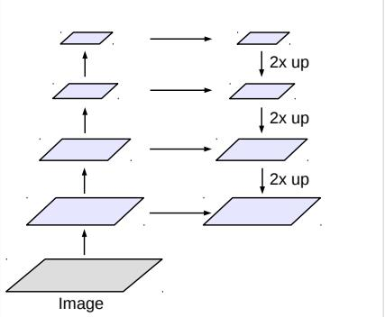

# 百度网盘AI大赛——图像处理挑战赛:文档图片去遮挡

[比赛链接](https://aistudio.baidu.com/aistudio/competition/detail/479/0/introduction)

## 前言

A榜第五，B榜第七

我觉得很不合理，为什么公布B榜，一般比赛都不公布B的呀，人均B比A高，就我低了，哎

我用的是pytorch框架，deepfiilv2无法转paddle模型，所以转的onnx

没有保存checkpoints, 用的parcharm运行，不喜欢用notebook，你按我说的来可以复现

该项目基于 https://github.com/zhaoyuzhi/deepfillv2 更改

## 1 方案

图像分割+图像修复

### 1.1 图像分割Deeplabv3

论文地址：https://arxiv.org/abs/1706.05587

因为我之前做过分割项目用这个Deeplabv3效果还不错就直接拿来做这个项目

#### 1.1.1 网络结构



他就是一个下采样再上采样类似FPN的结构，骨干可以是mobilnet也可以是resnet

#### 1.1.2 分割结果

由于原图大概是3000×4000的大小，将其缩为原图1/6，即480×640的大小进行计算


### 1.2 修复网络Deepfillv2

论文地址：https://arxiv.org/abs/1806.03589

### 1.2.1 网络结构


它是一个GAN网络，生成器生成粗修和精修结果，判别器判定效果

### 1.2.2 局部修复

原图尺寸过大，需要缩放后才能运算，如果缩放至256大小的话会损失大量的表格和文字细节，修复结果不好。
而需要修复的地方只占原图一小部分，我们只需要裁剪出这片区域将其修复再替换原图相应区域即可。

具体做法如下图：


裁剪的区域边长l = 1536， 缩放因子r = 6， 缩放后图像大小为256×256再位于InpaintingNet.


### 1.2.3 结果


粗修图（左）没有修复出边框，精修图（右）修复出大致的边框
##  2 代码说明

模型下载地址

链接：https://pan.baidu.com/s/1kSQj1JOZF1ExCUa74SV63g 

提取码：a350

### 2.1 Train Deeplabv3

首先训练图像分割网络, 骨干网络有resnet50, resnet101, mobilenetv2可选，
mobilenetv2和resnet50效果都差不多，mobilenetv2参数量少，但GPU推理慢，resnet50参数大反而推理快一些。
权重衰减为每100个step，lr = 0.95*lr, batch size为16， trainloader长度为900. 训练2个epoch基本就差不多了。
以下是主要参数

```bash
python train.py     --train_model 'deeplabv3'
                    --epochs 2
                    --batch_size2 16
                    --lr_s 0.0001
                    --lr_decrease_factor 0.95
                    --lr_decrease_step 100
                    --backbone 'resnet50'
                    --baseroot [train set path, train_data_1-5 are in this folder]
```
### 2.2 Train Deepfillv2

再训练deepfillv2, 生成器和判别器默认原项目作者的学习率效果较好，权重衰减为每100个step，lr = 0.95*lr, 
采用混合精度训练，batch size为增大至24，trainloader长度为600. L1损失系数太小没有效果，因此设置为1000.
图像imgsize是在原图裁剪的原始图像大小，训练时需要resize，这里裁剪图像尺寸1536×1536，缩放为1/6即256×256较为合理。
以下是主要参数
```bash
python train.py     --train_model 'deepfillv2'
                    --epochs 3
                    --lr_g 0.0001
                    --lr_d 0.0004
                    --lr_decrease_factor 0.95
                    --lr_decrease_step 100
                    --lambda_l1 1000
                    --lambda_gan 1
                    --autocast True
                    --batch_size1 24
                    --imgsize 1536
                    --imgresize 6
                    --baseroot [train set path, train_data_1-5 are in this folder]
```
训练三个epoch后，提交结果模型psnr达到37，Generator损失下降不了，我当时为了继续提升，
采用Generator每更新3次，Discriminator更新1次的策略，再训练1-3个epoch, 可再提升1%

```bash
if you have more than one GPU, please change following codes:
python train.py     --multi_gpu True
                    --gpu_ids [the ids of your multi-GPUs]
```

### 2.3 预测
#### 2.3.1 预测单张图片查看效果
运行predict_single.py可得到预测结果对比图，分别为：图像分割图，粗修图，精修图。
你需要设置你训练的权重文件路径，注意imgsize, imgresize, backbone都要与训练时一样。
```bash
python predict_single.py    --image_path 'test_img/test.jpg'
                            --imgsize 1536
                            --imgresize 6
                            --deepfillv2_generator_pretrain './pytorch_model/deepfillv2_G.pth'
                            --deeplabv3_pretrain  './pytorch_model/deeplabv3_resnet50.pth'
                            --backbone 'resnet50'
```
### 2.3.2 导出onnx并预测多张图片
运行convert导出onnx模型，你需要设置你的pytorch模型路径，以及onnx模型保存的路径(和名字)
```bash
python convert.py   --deepfillv2_generator_pretrain './pytorch_model/deepfillv2_G.pth'
                    --deeplabv3_pretrain  './pytorch_model/deeplabv3_resnet50.pth'
                    --backbone 'resnet50'
                    --save_path1 './onnx_model/deeplabv3_resnet50.onnx'
                    --save_path2 './onnx_model/deepfillv2_G.onnx'
```
运行predict_onnx.py预测图片，你需要设置要预测的图片文件夹路径，以及onnx模型保存的路径(和名字)，注意imgsize, imgresize要与前面一样。
```bash
python predict_onnx.py  --src_image_dir 'test_img'
                        --save_dir 'test_img_predict'
                        --imgsize 1536
                        --imgresize 6
                        --deeplabv3_onnx './onnx_model/deeplabv3_resnet50.onnx'
                        --deepfillv2_onnx './onnx_model/deepfillv2_G.onnx'
```

## 3 代码运行环境
* GPU RTX3090
* ubuntu 20.04.1
* cuda == 11.3
* python == 3.8.13 
* pytorch == 1.10.1 
* torchvision == 0.11.2
* onnxruntime == 1.12.1
* cv2 == 4.5.5
* transformers == 4.21.1   
* numpy == 1.22.4
